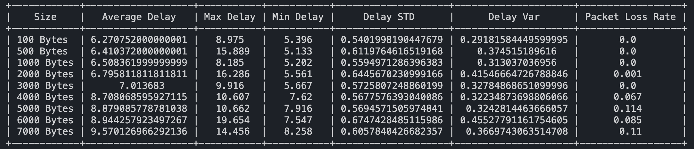
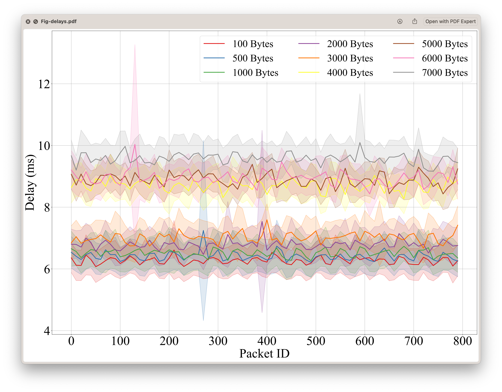

# C-V2X-End-to-End-Delay-Analysis

This project analyzes end-to-end communication delay and packet loss using Datang Gohigh C-V2X OBU and RSU.

## Features

1. Analyzes the characteristics of C-V2X end-to-end delay, such as maximum delay, minimum delay, packet loss rate, etc.
2. Uses a well-formatted table to output the delay characteristics.
3. Draws a figure to compare C-V2X end-to-end delay under different packet data sizes.

## Usages

1. Install the required Python packages, including NumPy, Pandas, Matplotlib, PrettyTable, and brewer2mpl:

```bash
pip install numpy pandas matplotlib prettytable brewer2mpl
```

2. Run the [main.ipynb](https://github.com/neardws/C-V2X-End-to-End-Delay-Analysis/blob/main/main.ipynb) file.

## Results





## Acknowledgments

Special thanks to [@yanguozhi](https://github.com/yanguozhi) for providing great help in obtaining the original C-V2X delay data.